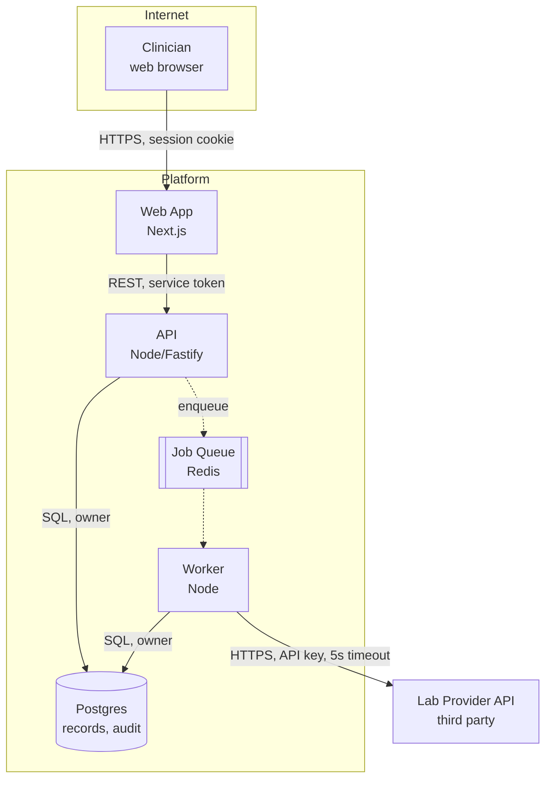

# Architecture Documentation

ADRs, RFCs, and C4 diagrams — what each is for, and how to write one someone will actually read in
two years.

Templates live in `templates/design.md`. This file is about the judgment: which document, what goes
in it, and what makes it useful versus ceremonial.

---

## Which document

| You need to | Write | Length |
|---|---|---|
| Record a decision already made | **ADR** | One page |
| Propose a decision and gather input | **RFC** | 2–5 pages |
| Explain the system's shape | **C4 diagrams** + architecture doc | Visual + prose |
| Explain how to work in this codebase | Contributing guide / `PROJECT-CONTEXT.md` | As needed |

The most common mistake is writing an RFC when an ADR would do. If the decision is made and
uncontroversial, do not run a review process — record it and move on. Ceremony spent on settled
questions is why people stop writing documents at all.

---

## ADRs

One decision per file, immutable once accepted.

### Why immutable matters

**Never edit an accepted ADR to reflect a changed mind.** Write a new ADR that supersedes it.

The reasoning history is the asset. In two years someone will propose exactly what you rejected. If
the record shows only the current answer, they will re-derive the argument from scratch and possibly
reach a different conclusion for reasons you already ruled out. If it shows ADR-014 chose Redis,
superseded by ADR-031 which moved to Postgres because operational burden exceeded the latency
benefit, they have the whole argument in thirty seconds.

Editing the old one destroys that. Status transitions are the only permitted change:
`proposed → accepted → superseded by ADR-NNN` (or `deprecated`).

### What to write

**Title**: the decision, in the imperative. "Use Postgres for session storage" — not "Session
storage" (a topic, not a decision) and not "Session storage investigation" (a process).

**Context**: the forces at play. Constraints, requirements, what you knew and did not. Enough that a
reader in two years understands why this was even a question. This is the section that ages best and
the one most often written too thin.

Write it so that someone who disagrees with the decision can still see it was reasonable given what
was known.

**Decision**: what you will do. Present tense, active voice. "We will store sessions in Postgres
using the existing connection pool."

**Consequences**: positive, negative, and neutral. **The negative section is the credibility test.**
An ADR with only benefits reads as advocacy and gets discounted. Name what gets harder.

**Alternatives**: what you rejected and why, one line each. Future readers will propose these again.

**Revisit when**: a *condition*, not a date. "When session volume exceeds 50k concurrent" is a
trigger someone trips. "In six months" is a calendar entry nobody honors.

### When to write one

Write an ADR when the decision is **expensive to reverse**, **non-obvious**, or **will be
questioned**.

Do write one for: choosing a datastore, an authentication approach, a service boundary, a
significant dependency, a consistency model, a deployment topology, or a deliberate deviation from an
existing pattern.

Do not write one for: naming conventions, a library with no real alternative, anything reversible in
an afternoon, or an implementation detail. An ADR corpus with 200 entries has the same problem as
one with zero — nobody can find the decisions that matter.

Rough calibration: a few ADRs per quarter on an active system. If you have none, decisions are going
unrecorded. If you have thirty, you are recording implementation details.

---

## RFCs

For decisions not yet made, where you need input before committing.

**Structure**: TL;DR (three sentences — many readers stop here) · Motivation · Detailed design ·
Alternatives · Risks and open questions · Migration path · Rollout plan.

**What makes an RFC work:**

- **The TL;DR is the deliverable for most readers.** Write it last, and make it complete enough to
  act on alone
- **Real alternatives, seriously argued.** An RFC with strawman alternatives fools nobody and wastes
  the reviewers' credibility budget along with yours
- **Open questions listed explicitly.** An RFC with no open questions is either not a real proposal
  or is concealing uncertainty
- **A migration path**, not just an end state. "Here is the better design" without "here is how we
  get there from what we have" is the most common way an RFC dies
- **A named decision point**: who decides, by when, and what happens if nobody does

**When it is accepted, write the ADR.** The RFC is the discussion; the ADR is the record. Keep both
— the RFC holds the reasoning that did not fit in one page.

---

## C4 diagrams

Four levels of zoom. The value of the model is that it forbids mixing levels, which is the single
most common diagram failure — a box labeled "AWS" next to a box labeled "UserValidator".

| Level | Shows | Audience | Keep updated |
|---|---|---|---|
| **1 — Context** | Your system, its users, its external dependencies | Everyone, including non-technical | Yes — changes rarely, high value |
| **2 — Container** | Deployable units and the stores between them | Engineers, ops | Yes — the most useful level |
| **3 — Component** | Modules inside one container | Engineers working in it | Only for complex containers |
| **4 — Code** | Classes and functions | Nobody. The IDE does this better | Never — generate on demand |

**Level 2 is the one worth maintaining.** It answers "what runs, and what talks to what" — the
question every new engineer and every incident responder has.

**Never hand-maintain level 4.** It is stale the day after you draw it, and the code is the accurate
version.

### Making a diagram carry information

A diagram that just lists components adds nothing over a bulleted list. Earn the space:

- **Show the direction of every dependency.** This is the highest-information element you can add,
  and it is what makes cycles visible
- **Mark trust boundaries.** Where does data cross from less-trusted to more-trusted?
- **Label the arrows** with protocol and purpose, not just "uses"
- **Distinguish sync from async.** A dashed line for events changes how the diagram reads
- **Include the data stores** and who owns each one

That diagram communicates the trust boundary, ownership of the database, which paths are async, and
that the external call has a timeout. A version with unlabeled arrows communicates roughly nothing.

**Keep diagrams in the repository as text.** Mermaid or similar. An image in a wiki cannot be
reviewed in a pull request, diffed, or updated by the person making the change — so it will not be.

---

## The architecture document

The prose around the diagrams. `templates/design.md` has the structure; the judgment:

**What belongs**: the component map and dependency directions, the two or three key flows traced end
to end including failure behavior, the trade-offs with chosen options, cross-cutting decisions made
once, and the consequences you accepted.

**What does not**: anything the code says better. A list of every class, every endpoint, every
configuration option. Those drift immediately and their existence teaches readers that the document
is unreliable.

**The test**: could a new senior engineer read this and make a correct design decision on their first
task? That is what it is for. Not completeness — orientation.

---

## Keeping it honest

Documentation decays, and decayed documentation is worse than none because people trust it once and
then stop trusting all of it.

Practices that actually hold:

- **Diagrams as text in the repo**, reviewed in the same PR as the change
- **`aidd-tech-writer` flags what a change made wrong** — that is an explicit gate in the pipeline,
  not a good intention
- **A decision made in a PR discussion with no ADR is a gap.** Flag it; the architect writes it
- **An ADR contradicted by the code is a finding.** Either the code drifted or the decision changed
  silently; both need someone to know
- **Date every document and note the commit it describes.** A reader can then judge staleness
  themselves

**Delete aggressively.** A document that is wrong should be deleted, not left with a "may be out of
date" note. Nobody knows which parts.

---

## Anti-patterns

- **Editing an accepted ADR.** Destroys the reasoning history, which is the whole asset.
- **An ADR with no negative consequences.** Reads as advocacy; gets discounted.
- **"Revisit in six months."** A calendar entry nobody honors. Use a condition.
- **An RFC where a one-page ADR would do.** Ceremony on a settled question.
- **Strawman alternatives.** Fools nobody, costs credibility.
- **An RFC with no open questions.** Concealing uncertainty.
- **An RFC with no migration path.** The most common way a good proposal dies.
- **Mixing C4 levels** in one diagram. "AWS" next to "UserValidator".
- **Hand-maintained level-4 diagrams.** Stale the next day.
- **Unlabeled arrows.** A diagram that communicates nothing.
- **Diagrams as images in a wiki.** Cannot be reviewed, diffed, or updated by the right person.
- **Documenting every class and endpoint.** Drifts instantly; teaches readers to distrust the doc.
- **200 ADRs.** Same problem as zero — the real decisions are unfindable.
- **Leaving a wrong document with a caveat.** Nobody knows which parts are wrong. Delete it.
