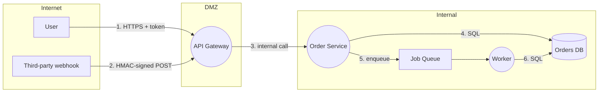

# Threat Modeling

How to find design-level flaws before they are built. This is the method behind A06 (Insecure
Design) — the category no scanner reaches, because the code is correct and the design is wrong.

Do this on any feature with a new input surface, a new trust boundary, or access to sensitive
data. Skip it for a copy change.

---

## The four questions

Everything else is scaffolding for these, in this order:

1. **What are we building?** A diagram accurate enough to argue about.
2. **What can go wrong?** STRIDE per boundary.
3. **What are we going to do about it?** A mitigation, and a criterion that verifies it.
4. **Did we do a good job?** Coverage check: does every High-ranked threat have a criterion?

Question 4 is the one teams skip, and it is what turns a threat model from a document into a
control.

---

## Step 1 — Draw the data flow

Not an architecture diagram. A **data flow** diagram, because threats live on the flows.

Four element types, and that is deliberately few:

| Element | Notation | Examples |
|---|---|---|
| External actor | rectangle | User, admin, third-party service, attacker |
| Process | circle | Your service, a job, a lambda |
| Data store | parallel lines | Database, cache, queue, bucket, log |
| Data flow | arrow | Every request, response, and write |

Then draw the **trust boundaries** — the lines where data moves from less-trusted to
more-trusted. These are where every threat you care about lives.



Number the flows. You will reference them in the threat table, and numbering forces you to
notice the flow you drew but never described.

**Boundaries in that diagram:** Internet→DMZ (flows 1, 2), DMZ→Internal (flow 3), and
Internal→data stores (4, 5, 6). Three boundaries, each needing validation, authentication, and
per-object authorization named explicitly.

The internal ones matter. "It's behind the gateway" is how a compromised service becomes a
compromised database.

---

## Step 2 — STRIDE per boundary

Walk each boundary and ask all six. Skipping a category is fine — say you skipped it and why,
because an unexamined category is indistinguishable from an absent threat.

| Letter | Threat | Asks | Control |
|---|---|---|---|
| **S** | Spoofing | Can someone claim to be another identity? | Authentication |
| **T** | Tampering | Can data be modified in flight or at rest? | Integrity checks, signing |
| **R** | Repudiation | Can someone deny an action they took? | Audit logging |
| **I** | Information disclosure | Can data leak to someone unauthorized? | Authorization, encryption |
| **D** | Denial of service | Can availability be degraded? | Rate limits, quotas, timeouts |
| **E** | Elevation of privilege | Can someone gain capability they lack? | Authorization, least privilege |

### Prompts that actually surface threats

Generic STRIDE produces generic findings. These produce specific ones:

**Spoofing** — Where is identity first established, and what does it rest on? Can a token be
replayed, and for how long? For webhooks: is the signature verified before the body is parsed?
Can one tenant present another tenant's identifier?

**Tampering** — Which values does the client send that the server trusts? Price, quantity,
total, role, account ID, timestamps? Is anything computed client-side and stored server-side?
Can a signed payload be modified while keeping the signature valid (algorithm confusion,
truncation, unsigned fields)?

**Repudiation** — For every irreversible or financial action: is there a record of who, what,
and when, that the actor cannot edit? Are logs written before or after the effect?

**Information disclosure** — What is in the response the client does not need? Does an error
message distinguish "not found" from "not yours"? Do timing differences reveal existence? What
is in logs, in the cache, in a backup, in an export, in an analytics payload, in a URL?

**Denial of service** — What is unbounded? Page size, upload size, recursion depth, regex on
user input, a query with no limit, a job that fans out per row. What does one user cost you at
maximum? Are rate limits scoped to the thing being protected?

**Elevation of privilege** — Can a normal user reach an admin function by calling it directly?
Is authorization re-checked after a role change, or cached at login? Is there a path where a
lower-privilege service calls a higher-privilege one without constraint?

---

## Step 3 — Rank, then mitigate

Likelihood × impact. Be honest about likelihood — inflating it to get a fix prioritized spends
the credibility you need for a genuine Critical.

| Rank | Meaning | Action |
|---|---|---|
| Critical | Remote unauthenticated compromise, or mass data exposure | Blocking. Stop the run. |
| High | Authenticated privilege escalation, or one user's sensitive data exposed | Blocking |
| Medium | Requires unusual conditions, or limited impact | Criterion if cheap; backlog if structural and low |
| Low | Defense in depth | Backlog |

Every threat you keep becomes a **criterion**, with an ID that traces back:

```markdown
| # | Threat | Cat | L | I | Mitigation | Criterion |
|---|---|---|---|---|---|---|
| 1 | Caller reads another tenant's order via flow 4 | I/E | High | High | Scope every query by tenant in the query itself | AC-S1 |
| 2 | Webhook replayed to double-credit an account | T/E | Med | High | Idempotency on the event ID + 5-min timestamp window | AC-S2 |
| 3 | Unbounded page size exhausts memory on flow 1 | D | Med | Med | Cap limit at 100, 400 above | AC-S3 |
```

Then:

```markdown
- [ ] AC-S1: A request for an order belonging to another tenant returns 404 (not 403).
      Verified by `npm test -- orders.tenant-isolation`
- [ ] AC-S2: Replaying a webhook with a seen event ID returns 200 and creates no second
      credit. Verified by `npm test -- webhook.replay`
- [ ] AC-S3: `GET /orders?limit=1000` returns 400 and executes no query.
      Verified by `npm test -- orders.limit`
```

Note that each names a command. A threat model whose mitigations are prose gets implemented
approximately.

---

## Step 4 — Coverage check

Before you hand off:

- [ ] Every trust boundary has validation, authentication, and per-object authorization named
- [ ] Every Critical and High threat has a criterion with a verification command
- [ ] Every accepted risk has a compensating control and a revisit condition
- [ ] Every STRIDE category was either applied or explicitly skipped with a reason
- [ ] Every numbered flow appears in at least one threat row, or is stated as out of scope

That last one catches the flow you drew and forgot.

---

## Accepted risks

Not every threat gets fixed. Documenting the decision is the difference between a risk and a
surprise.

```markdown
| Risk | Why accepted | Compensating control | Revisit when |
|---|---|---|---|
| No rate limit on internal service-to-service calls | Only reachable from inside the VPC; adding it now would delay launch two weeks | Network policy restricts callers; alert on anomalous call volume | Before any external partner gets network access |
```

"Revisit when" must be a condition, not a date. A date is a calendar entry nobody honors; a
condition is a trigger someone trips.

---

## Worked example — "users can export their data as CSV"

A feature that sounds harmless. The threat model finds four real issues.

**Flows:** (1) User → API `POST /exports`, (2) API → job queue, (3) Worker → database,
(4) Worker → object storage, (5) User → signed download URL.

| # | Threat | Cat | Rank | Mitigation | Criterion |
|---|---|---|---|---|---|
| 1 | Export includes columns the user should not see (internal notes, other users' data joined in) | I | High | Explicit column allowlist in the query; never `SELECT *` | AC-S1 |
| 2 | Signed download URL is guessable, or long-lived, or leaks via referrer | I | High | 128-bit random object key, 15-min expiry, `Referrer-Policy` on the download page | AC-S2 |
| 3 | User requests 10,000 exports; worker pool saturates for everyone | D | Med | One in-flight export per user; queue depth alert | AC-S3 |
| 4 | Export of user A's data queued, user A deleted, worker still writes the file | I | Med | Worker re-checks authorization at execution time, not just at enqueue | AC-S4 |

Threat 4 is the one that only appears from drawing the flows: the authorization check happened
at flow 1, but the data access happens at flow 3, in a different process, later. **Async work
moves the data access away from the authorization check** — that gap is invisible in code
review and obvious in a data flow diagram.

That single finding is the return on doing this.

---

## When to stop

Threat modeling has diminishing returns and a real failure mode: a 40-row table nobody reads.

Stop when the next threat you would write is Low, or when you are describing generic web
threats rather than threats specific to this design. Ten specific rows beat forty generic ones.

The output is not the document. The output is the criteria in the spec.
