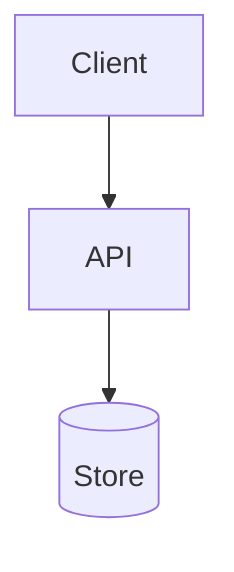

# Templates — Solutioning

Used by `aidd-architect`, `aidd-backend`, `aidd-frontend`, and `aidd-security`. L2+ runs.

---

## Architecture Document

Owner: `aidd-architect` → `docs/architecture/architecture.md`

````markdown
# Architecture — <system or feature>

PRD: docs/product/prd.md
Status: draft | approved
Supersedes: <prior version, if any>

## Context
<What exists today. Be concrete — name the components and where they live. A reader who
knows nothing about this repo should be able to find them.>

## Drivers
The quality attributes this design optimizes for, in priority order. Ordering them is
the actual work; a design that claims to optimize all seven has not made a decision.

| # | Attribute | Requirement | Why it ranks here |
|---|---|---|---|
| 1 | | | |

## Design

<Mermaid diagram. Components, boundaries, and the direction of every dependency.>



### Components
| Component | Responsibility | Owns data | Depends on |
|---|---|---|---|

### Key flows
<For each significant flow: sequence of calls, where it can fail, what happens when it
does.>

## Trade-offs

### Decision — <what was decided>
**Option A: <name>**
- ✅ <advantage>
- ❌ <cost>
- 📌 Best when: <context>

**Option B: <name>**
- ✅ / ❌ / 📌

**Chosen**: <option> because <reason tied to the driver ranking above>.
**Revisit when**: <the concrete condition that would change this answer>.

## Data
| Entity | Store | Key fields | Retention | Migration needed |
|---|---|---|---|---|

## Failure modes
| Failure | Detection | Blast radius | Mitigation |
|---|---|---|---|

## Cross-cutting
| Concern | Approach |
|---|---|
| Auth / authz | |
| Validation | |
| Errors | |
| Observability | |
| Config & secrets | |
| Idempotency | |

## Rejected alternatives
| Alternative | Why not |
|---|---|
<Future readers will propose these again. Write down why not, or you will re-argue it.>

## Consequences
**Accepted costs**: <what gets harder>
**New constraints**: <what future work must respect>
**Debt created**: <deliberate shortcuts, with the condition for paying them down>
````

---

## ADR

Owner: `aidd-architect` → `docs/architecture/adr/NNN-<slug>.md`

One decision per file. Immutable once accepted — a changed mind is a new ADR that
supersedes the old one, because the reasoning history is the value.

```markdown
# ADR-NNN — <decision in the imperative: "Use X for Y">

Date: YYYY-MM-DD
Status: proposed | accepted | superseded by ADR-MMM | deprecated
Deciders: <who>

## Context
<The forces at play. Constraints, requirements, what we know and what we do not. Enough
that someone in two years understands why this was even a question.>

## Decision
<What we will do. Present tense, active voice: "We will store sessions in Redis.">

## Consequences
**Positive**: <what improves>
**Negative**: <what we accept as cost>
**Neutral**: <what changes without being better or worse>

## Alternatives
| Option | Why rejected |
|---|---|

## Revisit when
<A condition, not a date. "When write volume exceeds 5k/s" beats "in six months".>
```

---

## Backend Spec

Owner: `aidd-backend` → `docs/design/backend-spec.md`

````markdown
# Backend Spec — <feature>

Architecture: docs/architecture/architecture.md
PRD: docs/product/prd.md

## API contract

### Envelope
<The response shape used by every endpoint here. Decided once, not per handler.>

### Endpoints
| Method | Path | Auth | Idempotent | Paginated | Success | Errors |
|---|---|---|---|---|---|---|

### Error codes
Enumerate every code a caller can receive. `code` is the contract; `message` is not, so
clients must never parse it. `aidd-tech-writer` documents the API from this table.

| Code | HTTP | Cause | Client should |
|---|---|---|---|

### Pagination
Style: cursor | offset  ·  Default limit: <n>  ·  Max limit: <n> (requests above it 400)
<Cursor for anything that grows or takes concurrent writes. Offset skips and duplicates rows
when the set changes between pages, and degrades linearly.>

### Idempotency
| Endpoint | Key source | Retention | Collision with a different payload |
|---|---|---|---|

### Versioning
Breaking here means: <removing a field | narrowing a type | new required param | changed error code>
Deprecation path: <how a client is warned, and for how long>

## Data model

### Schema changes
| Table | Column | Type | Null | Constraint | Default |
|---|---|---|---|---|---|

Constraints belong in the database, not only in application code — they are the only rules
that hold when a second writer appears (a backfill, an admin tool, a manual fix).

### Indexes
Indexes follow the queries below, not intuition. Equality columns before range columns.

| Index | Table | Columns | Serves which query | Verified with |
|---|---|---|---|---|

### Query patterns
| Query | Frequency | Rows examined / returned | Index used | Max queries per request |
|---|---|---|---|---|

### Decisions
Soft delete: <yes, because … | no> — it changes every query in the system forever.
Time: <UTC instants; original timezone stored separately where wall-clock matters>
Money: <integer minor units | exact decimal> + currency stored per amount. Never float.

## Transactions

| Write path | Atomic scope | Isolation | On partial failure |
|---|---|---|---|

### Concurrency hazards
Every read-modify-write on balance, quota, inventory, seat count, a single-use token, or a
state machine goes here with its protection named.

| Path | Hazard | Protection (atomic conditional write / optimistic version / row lock) |
|---|---|---|

### External calls inside a write path
<A write spanning the database and something outside it has no transaction. Name the
mechanism: outbox, saga, or idempotent retry.>

| Path | External dependency | Mechanism |
|---|---|---|

## Background jobs

Assume at-least-once delivery. Every handler must be idempotent — that is a design property,
not something added later.

| Job | Trigger | Rate | Idempotent by | Retry | Max attempts | DLQ monitored by | Ordering required |
|---|---|---|---|---|---|---|---|

Signals per job — queue depth and **age of oldest message**. A dead worker looks identical to
a quiet period unless you watch age.

## Caching
| What | Key | TTL | Invalidated by | Tolerable staleness |
|---|---|---|---|---|

<A cache with no invalidation story is a correctness bug with better latency. Do not add one
before measuring the query it hides.>

## Performance budget
| Endpoint | Max queries | p95 | At what data volume |
|---|---|---|---|

## Backend acceptance criteria
Appended to the active spec before scope freeze. Each testable.

- [ ] AC-B1: <specific — name the query count, the index, the number. "Fast" is not
      verifiable and will not be verified.>

## Handed to devops
| Migration | Reversible | Needs prod-sized timing test |
|---|---|---|
````

---

## UX Spec

Owner: `aidd-frontend` → `docs/design/ux-spec.md`

```markdown
# UX Spec — <feature>

PRD: docs/product/prd.md
Architecture: docs/architecture/architecture.md

## Flows
<For each: entry point, steps, exit, and what a user can do at each step.>

## States
Every view specifies all six. Missing states are the most common UI defect class, and
they are cheap to catch here and expensive to catch in review.

| View | Empty | Loading | Partial | Error | Success | Disabled/no-permission |
|---|---|---|---|---|---|---|

## Components
| Component | New or existing | Props / variants | Reused from |
|---|---|---|---|
<Prefer existing. A new component that duplicates an existing one is debt created at
design time.>

## Accessibility criteria
Target: <WCAG level from PROJECT-CONTEXT.md>

- [ ] Every interactive element is keyboard reachable, in a logical tab order
- [ ] Visible focus indicator, contrast ≥ 3:1 against adjacent colors
- [ ] Text contrast ≥ 4.5:1 (≥ 3:1 for large text)
- [ ] Form inputs have programmatically associated labels
- [ ] Errors are announced to assistive tech and identify the field
- [ ] Dynamic content changes announced via live region
- [ ] Meaning never carried by color alone
- [ ] Images have alt text; decorative images have empty alt
- [ ] Heading levels are sequential; landmarks present
- [ ] Usable at 200% zoom and 320px width without horizontal scroll
- [ ] Motion respects prefers-reduced-motion

## Styling
Decided here, before the freeze — otherwise it gets improvised per component during
implementation and diverges. See `aidd-frontend`'s `styling.md`.

### Tokens this feature needs
| Need | Existing token | New token required |
|---|---|---|
<A new token is a system decision, not a local one. If this feature needs one, say so here so
it is reviewed rather than invented in a component file.>

### Off-system values
<Anything that cannot come from the scale, and why. An empty section is the good outcome; a
populated one is a conversation to have now rather than in review.>

### Themes
Renders in: <light | dark | both | high-contrast>
Contrast verified in: <each theme, separately — dark inverts the luminance relationship>

### Enforcement
| Rule | Enforced by |
|---|---|
| No raw colors | `<lint command>` |
| Spacing on scale | `<lint command>` |
| No `!important` | `<lint command>` |
| Theme correctness | `<visual regression command>` |

<Lint converts a style debate into a build failure. If the project has no such rules, that is
a backlog item worth raising, not a reason to skip the row.>

## Responsive
Breakpoints come from the system, never from a component. A component-local media query is a
finding.

| Breakpoint | Layout change |
|---|---|

## Performance budget
| Metric | Budget |
|---|---|
| LCP | |
| INP | |
| CLS | |
| JS added by this feature | |

## Copy
| Location | Text | Notes |
|---|---|---|
<Exact strings, including error messages. "Show a friendly error" is not a spec — the
implementer will invent one, and inventing user-facing copy violates Article X.>
```

---

## Threat Model

Owner: `aidd-security` → `docs/security/threat-model.md`

```markdown
# Threat Model — <feature or system>

Architecture: docs/architecture/architecture.md
Standard: <e.g. OWASP ASVS 5.0 Level 2>

## Assets
| Asset | Sensitivity | Impact if compromised |
|---|---|---|

## Trust boundaries
<Where data crosses from less-trusted to more-trusted. Every boundary needs validation,
authentication, and authorization — name them per boundary.>

| Boundary | Crossing data | Validated where | Authz check |
|---|---|---|---|

## Threats (STRIDE)
| # | Threat | Category | Likelihood | Impact | Mitigation | Criterion |
|---|---|---|---|---|---|---|
| 1 | | Spoofing / Tampering / Repudiation / Info disclosure / DoS / Elevation | | | | AC-S1 |

## Security acceptance criteria
Appended to the active spec before scope freeze. Each must be testable.

- [ ] AC-S1: <specific, verifiable — "requests without a valid token return 401", not
      "endpoint is secured">

## Accepted risks
| Risk | Why accepted | Compensating control | Revisit when |
|---|---|---|---|
```
