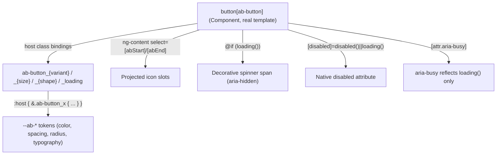

# Architecture — AbButton

PRD: none (L2 run, no PRD — see `specs/ab-button/spec.md` for the contract)
Status: approved

## Context

`projects/abbos` currently ships one component, `AbInput` (`input[ab-input]`, see
`docs/architecture/architecture.md` and ADR-0001). `AbButton` is the second. Unlike
`AbInput`, the native element it decorates (`<button>`) is **not** a void element — it can
have DOM children — so the constraint that forced `AbInput` toward a bare, template-less
shape does not apply here.

Root `CLAUDE.md` documents `AbButton` as `button[ab-button]`, with shared vocabulary
`variant`/`size`/`shape`, and separately describes `abStart`/`abEnd` projected-adornment
slots as the mechanism for icons on "a different, wrapper-based component" (written while
scoping `AbInput`, which cannot host them). `AbButton` is exactly that wrapper-based
component — it is the first place `abStart`/`abEnd` gets built for real.

No component-level design source of truth exists in this repo or the sibling
`AbbosDesignSystem` React repo (not present on this machine). However, a **prior iteration
of this exact Angular library** exists locally at `/Users/juano/Docs/Projects/abbos.old`
(same author, same token names, same `Ab`-prefix convention, now superseded by a from-scratch
rewrite starting at this repo's `initial commit`). It contains a working `AbButton` +
`AbIconButton` pair
(`projects/abbos/src/lib/old/button/`, `.../old/icon-button/`) built against token names that
still exist verbatim in this repo's `src/lib/assets/styles/tokens/`. Per Article X, this is
treated as **evidence, not invention**: it resolves what would otherwise be
`[NEEDS CLARIFICATION]` on variant values and the icon-slot API, cited explicitly wherever
used below. Where this run's implementation deviates from that reference, the deviation and
its reason are called out explicitly (see Trade-offs).

## Drivers

| # | Attribute | Requirement | Why it ranks here |
|---|---|---|---|
| 1 | Consistency | Second component — reuses `AbControlSize`/`AbControlShape`, follows `AbInput`'s host-class + `:host`-scoped-`styleUrl` reflection mechanism | Sets the pattern the remaining roadmap components (`AbIconButton`, `AbSwitch`) will copy |
| 2 | Accessibility | WCAG AA + 0 axe violations (mandated by `.claude/CLAUDE.md`); loading/disabled states must be announced, not just visual | Non-negotiable project quality bar; a button with a silent busy state is a common real-world a11y bug |
| 3 | Minimalism | API limited to what the user's request + CLAUDE.md's documented shared vocabulary require — no speculative props | Article III; the discovered reference implementation has props (`fullWidth`) not asked for here |
| 4 | Compatibility | Behaves as a plain native `<button>` in every way not explicitly overridden (type semantics, native `disabled`, click events) | Consumers shouldn't need to know this is a design-system control to use it in a form or a click handler |

## Design

### Components

| Component | Responsibility | Owns data | Depends on |
|---|---|---|---|
| `AbButton` | Styles + structures a native `<button>`: variant/size/shape visuals, start/end icon projection, loading spinner + busy state, disabled reflection | None — no internal state, all inputs | `AbControlSize`, `AbControlShape` (existing shared types); `--ab-*` tokens |

### Key flows

**Click / form submission.** Not implemented by `AbButton` at all. A native `<button>`
already dispatches `click` and, inside a `<form>`, submits/resets per its `type` attribute
with zero help from `AbButton` — the component adds no click handling and does not default
or override `type`. See Trade-offs — "No default `type`".

**Loading state.** `loading()` is the only input with cross-cutting behavior: it (a) forces
`disabled` on the native element (`[disabled]="disabled() || loading()"`), (b) sets
`aria-busy="true"` so assistive tech announces the busy state without relying on visual-only
cues, (c) renders a decorative (`aria-hidden="true"`) spinner, and (d) hides the projected
`abStart`/`abEnd` icon slots via CSS while loading (the projected text label stays visible
alongside the spinner) — same behavior as the reference implementation.

## Trade-offs

### Decision — `Component`, not `Directive`

**Option A: `@Directive`, matching `AbInput` (ADR-0001's default for future controls)**
- ❌ ADR-0001's "default to Directive" guidance is scoped to controls that decorate a
  **native form element with no view of its own** (its literal wording: "every future
  control that decorates a native form element… should default to Component, empty
  template" — this repo's convention is actually "Component with an empty template", not
  "Directive"; either way, both assume no real content). `<button>` needs a real view: a
  conditional spinner, two named projection outlets, and a default outlet for the label.
  Angular directives have no template — they cannot render any of that.

**Option B: `@Component` with a template (`ng-content` projection, conditional spinner)**
- ✅ `<button>` is not a void element — unlike `AbInput`'s problem, a component's template
  legitimately renders as the host's content here.
- ✅ Matches the discovered reference implementation and how Angular Material's `mat-button`
  family (also non-void elements) is built.
- 📌 Best when: the selector targets a native element that can have children and the
  control needs to render its own markup around/inside projected content.

**Chosen**: B, `@Component`. This is a distinct case from `AbInput` — a new ADR (ADR-0002)
rather than an amendment to ADR-0001, since the two components made a different decision for
a different, well-understood reason (void vs. non-void host element), not a reversal of the
same one.

### Decision — Host-state reflection: classes, not `data-*` attributes

The discovered reference implementation and `CLAUDE.md`'s current prose both describe
`variant`/`size`/`shape` as `data-*` host attributes (`[attr.data-variant]`, styled via
`:host([data-variant='…'])`). `AbInput`, as actually shipped in this repo (not as originally
planned), instead reflects `size`/`shape` as BEM-style host **classes**
(`ab-input_sm`, …), each nested inside `:host { &.ab-input_sm { … } }` in the component's own
`styleUrl` — see `specs/ab-input/spec.md`'s 2026-08-04 amendment and ADR-0001's amendment.

**Option A: `data-*` attributes**, per the reference implementation and `CLAUDE.md`'s
current (stale) wording.
- ✅ Matches the design-source-of-truth reference verbatim.
- ❌ Diverges from what `AbInput` actually ships today, so the two components in this
  library would use two different reflection mechanisms for the same kind of state — the
  opposite of driver #1 (Consistency), and re-litigates `AbInput`'s own open item
  (`specs/ab-input/spec.md` AC-F3/AC-F4) instead of resolving it.

**Option B: BEM host classes, nested under `:host` in the component's `styleUrl`** — matches
`AbInput` as shipped.
- ✅ Consistent with the one other component in the library today.
- ✅ Sidesteps `AbInput`'s still-open `data-*`-vs-class question entirely for new code
  rather than deepening it.
- ❌ Diverges from the discovered reference implementation's mechanism (not its variant
  *values*, *colors*, or *behavior* — only how state is exposed on the host element).

**Chosen**: B. The user's own instruction for this run ("follow the same pattern as the
AbInput") is read here as "match `AbInput`'s shipped code", the more concrete and current
source, over `CLAUDE.md`'s prose or the older reference project. Recorded explicitly per
Article X so this isn't a silent deviation from the reference. **Revisit when**: `AbInput`'s
open `data-*`-vs-class question (`specs/ab-input/spec.md`) is resolved one way — if it
resolves toward `data-*` attributes, `AbButton` should be revisited in the same pass so the
two stay consistent.

### Decision — `variant` values

Sourced from the reference implementation's `AbButton`
(`primary | secondary | soft | outline | ghost | danger`, default `primary`) — every color
token each variant maps to (`--ab-primary`, `--ab-surface-2`, `--ab-primary-soft`,
`--ab-danger`, etc.) still exists verbatim in this repo's current token files, confirmed by
inspection before adopting them. Not invented; not asked for by the user beyond
"configurable variants" so the enumeration itself is a judgment call, but it is a judgment
grounded in the one available design-source evidence rather than a guess.

**Addendum, found during implementation**: the reference implementation's own color mapping
for `primary`/`danger` (white text directly on the raw `--ab-primary`/`--ab-danger` token)
fails WCAG AA 4.5:1 text contrast in light theme when checked by hand — 3.46:1 and 3.91:1
respectively. `AbButton` does not reproduce that defect: both variants' resting/hover/active
backgrounds are derived locally via `color-mix()` (component-scoped, no global token
changed), with `primary` reverted to the raw tokens specifically in dark theme, where the
raw pairing already passes. Full computation and rationale in `specs/ab-button/spec.md`
AC-U6/AC-U7. This is a deviation from the reference implementation's *values*, not just its
host-reflection *mechanism* (see the Trade-offs entry above) — flagged here because it's the
second, more consequential place this run diverged from the discovered source of truth, and
because the underlying token pairing defect predates this run and isn't `AbButton`-specific
(see `BACKLOG.md`).

### Decision — Icon projection via `abStart`/`abEnd`, not dedicated inputs

**Option A: `iconStart`/`iconEnd` template-ref or component-type inputs**
- ❌ Forces a specific icon-rendering mechanism (e.g., requiring consumers' icons to be
  Angular components or template refs) that this library does not otherwise standardize on.

**Option B: `<ng-content select="[abStart]" />` / `<ng-content select="[abEnd]" />`**
- ✅ Matches `CLAUDE.md`'s already-documented adornment vocabulary (`abStart`/`abEnd`,
  previously written for a wrapper-based component that didn't exist yet — this is that
  component) and the reference implementation verbatim.
- ✅ Consumer supplies any markup (`<svg abStart>`, an icon-font ``, …) with
  no coupling to a specific icon library.

**Chosen**: B. Slots collapse (`display: none`) when empty so an icon-less button has no
stray gap, and are hidden entirely while `loading()` (spinner takes their place visually).

### Decision — `shape` included, `fullWidth` excluded

`shape` (`square`/`round`/`circle`) is included even though the user's request text did not
name it explicitly, because `CLAUDE.md` already documents `shape` as shared vocabulary
spanning `AbButton` specifically, and it is free — `AbControlShape` already exists and
`AbInput` already establishes the pattern. This is fulfilling already-documented scope, not
opportunistic addition (Article III).

`fullWidth` (present in the reference implementation) is **not** included — neither the
user's request nor `CLAUDE.md`'s documented vocabulary for `AbButton` names it. Backlogged
(see `BACKLOG.md`) rather than added silently.

### Decision — No default `type`

The native `<button>` default (`submit` inside a `<form>`, otherwise inert) is left
untouched — `AbButton` does not set or default `type`. Consistent with `AbInput`'s
"presentation only, delegate native semantics to the browser/Angular" philosophy (ADR-0001):
a consumer placing `<button ab-button>Save</button>` inside a `<form>` gets ordinary
submit-button behavior with no surprise, and one placing it outside a form, or wanting
`type="button"`/`type="reset"`, sets it explicitly exactly as they would on a plain
`<button>`.

## Cross-cutting

| Concern | Approach |
|---|---|
| Auth / authz | N/A — no data access |
| Validation | N/A — no form-value semantics; a button is not a value control |
| Errors | N/A — component cannot fail at runtime beyond standard Angular template errors |
| Observability | N/A |
| Config & secrets | N/A |
| Accessibility | See `specs/ab-button/spec.md` AC-U — `aria-busy` while loading, decorative spinner is `aria-hidden`, native `disabled` (not a visual-only fake-disabled class), focus ring contrast computed per variant background |

## Rejected alternatives

| Alternative | Why not |
|---|---|
| `@Directive`, matching `AbInput`'s mechanism | See Trade-offs — `<button>` needs a real template; `AbInput`'s constraint (void element) doesn't apply. |
| `data-*` attribute host reflection, matching the reference implementation and `CLAUDE.md`'s current prose | See Trade-offs — would diverge from what `AbInput` actually ships and re-open its own unresolved `data-*`-vs-class question instead of settling it. |
| Icon props typed to a specific icon component/library | See Trade-offs — `abStart`/`abEnd` projection keeps `AbButton` icon-library-agnostic, matching `CLAUDE.md`'s documented (if previously unbuilt) intent. |
| `fullWidth` input | Not requested by the user or `CLAUDE.md`'s documented vocabulary for this component; backlogged rather than added opportunistically. |
| Default `type="button"` to prevent accidental form submits | Would silently change standard `<button>` semantics for every consumer; a footgun-prevention feature nobody asked for and no criterion covers — backlogged as a documentation reminder instead (spec.md AC-U note), not a behavior change. |

## Consequences

**Accepted costs**: the reflection-mechanism decision (classes, not `data-*`) means
`AbButton` cannot be pointed at as a second data point resolving `AbInput`'s open
`data-*`-vs-class question — if that question resolves toward `data-*` later, `AbButton`
needs a follow-up pass to match.

**New constraints**: any future component that needs a real template (has projected
content, conditional internal markup, or otherwise can't be a bare directive) follows this
run's two conventions — `@Component` with a real template when the host element is not
void, and host-state reflection via `:host`-scoped BEM classes in the component's own
`styleUrl`, matching `AbInput`.

**Debt created**: `fullWidth` unimplemented (backlog, reference implementation has it).
`AbIconButton` (the icon-only sibling documented in `CLAUDE.md` and present in the
reference implementation) remains unbuilt — out of scope for this run, which was scoped to
`AbButton` only.
