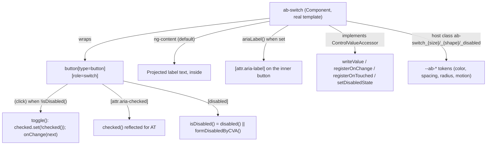

# Architecture — AbSwitch

PRD: none (L2 run, no PRD — see `specs/ab-switch/spec.md` for the contract)
Status: approved

## Context

`projects/abbos` currently ships `AbInput` (`input[ab-input]`, ADR-0001 — Component, empty
template, no CVA, delegates to Angular's `DefaultValueAccessor`) and `AbButton`
(`button[ab-button]`, ADR-0002 — Component with a real template, content projection,
`:host`-scoped BEM class host-state reflection). `AbSwitch` is the third and is a different
shape from both: it is a boolean toggle, not a native HTML form element Angular already
knows how to drive — there is no native `<switch>` element, so unlike `AbInput` it cannot
delegate to `DefaultValueAccessor`, and unlike `AbButton` it *does* carry a form value.

Root `CLAUDE.md` already documents the contract: `ab-switch` selector, `[(checked)]` model,
and a `ControlValueAccessor`. That much is settled, not a decision this run makes.

No component-level design source of truth exists in this repo or the sibling
`AbbosDesignSystem` React repo (not present on this machine). A **prior iteration of this
exact Angular library** exists locally at `/Users/juano/Docs/Projects/abbos.old`, same author,
same token names, superseded by this repo's from-scratch rewrite. It contains a working
`AbSwitch` (`projects/abbos/src/lib/old/switch/`) — a `<label>` wrapping a
`<button type="button" role="switch">` with a knob, `model(false)` for `checked`, a real
`ControlValueAccessor`, and `data-size` host-attribute reflection. Per Article X this is
treated as evidence, not invention, the same way `AbButton`'s architecture treated the
reference `AbButton`. Deviations from it and their reasons are called out below.

## Drivers

| # | Attribute | Requirement | Why it ranks here |
|---|---|---|---|
| 1 | Accessibility | WCAG AA + 0 axe violations (mandated by `.claude/CLAUDE.md`); a toggle's on/off state, disabled state, and accessible name must all be programmatically determinable | A switch with no accessible name or a state that's only conveyed visually is a common real-world a11y bug, and this component has no native element to inherit correctness from |
| 2 | Consistency | Reuses `AbControlSize`/`AbControlShape`; host-state reflection follows `AbButton`/`AbInput`'s shipped `:host`-scoped BEM class mechanism, not the reference implementation's `data-*` attributes | Third component — the pattern is now established, not still being decided |
| 3 | Forms correctness | `ControlValueAccessor` must interoperate with Reactive Forms (`formControlName`/`[formControl]`) including `setDisabledState`, and with plain `[(checked)]` two-way binding, without either mode fighting the other | `CLAUDE.md` commits to both explicitly ("`[(checked)]` model + ControlValueAccessor") |
| 4 | Minimalism | API limited to what `CLAUDE.md`'s documented vocabulary + the user's request require — no speculative props | Article III |

## Design

### Components

| Component | Responsibility | Owns data | Depends on |
|---|---|---|---|
| `AbSwitch` | Renders a labeled boolean toggle; owns `checked` state; bridges it to Angular forms via `ControlValueAccessor` | `checked` (model, source of truth), `formDisabled` (internal signal set by `setDisabledState`) | `AbControlSize`, `AbControlShape` (existing shared types); `CONTROL_SIZE`/`CONTROL_SHAPE` tokens; `--ab-*` tokens |

### Key flows

**User click / keyboard activation.** The inner element is a real `<button type="button">` —
Angular adds no keyboard handling of its own, because it doesn't need to: a native button
already fires `click` on Enter/Space and participates in normal tab order. `role="switch"`
overrides the accessible role without changing any of that native behavior. On click, if not
disabled, `checked` flips, `onChange` (registered by Angular forms, or a no-op if the
component isn't inside a form) fires with the new value, and `onTouched` fires on `blur`
(marks the control touched for `.ng-touched`-driven styling, same as `AbInput`'s reliance on
Angular's automatic classes).

**Two-way binding (`[(checked)]`).** `checked` is a `model()`, so `<ab-switch
[(checked)]="on">` works with zero CVA involvement — the toggle mutates the signal directly,
same as the reference implementation and same as `AbButton` needing no CVA at all (`AbButton`
has no value; `AbSwitch` has two independent ways to set the same value).

**Reactive Forms (`formControlName`/`[formControl]`).** `AbSwitch` implements
`ControlValueAccessor` and registers itself via `NG_VALUE_ACCESSOR`
(`forwardRef(() => AbSwitch)`, `multi: true`) — Angular's forms module calls `writeValue` on
external changes and `AbSwitch` calls `registerOnChange`'s callback on user toggles. Because
`checked` is a `model()`, `writeValue` just calls `checked.set(...)` — the same signal is the
single source of truth for both binding modes, so they cannot drift out of sync with each
other the way two separately-tracked pieces of state could.

**Disabled state — two independent sources.** `disabled` (plain input, for template-driven
use: `<ab-switch disabled>`) and `setDisabledState` (called by Reactive Forms when the bound
`FormControl` is disabled) are ORed together (`isDisabled = disabled() || formDisabled()`),
matching the reference implementation. Neither can un-disable what the other disabled.

## Trade-offs

### Decision — `Component` with a real template wrapping a synthetic `<button role="switch">`

**Option A: `@Directive` decorating a native element, matching `AbInput` (ADR-0001's default)**
- ❌ No native HTML element represents a switch. `AbInput`'s directive shape works only
  because `<input>` already has the right semantics and a `DefaultValueAccessor` to delegate
  to; nothing analogous exists here.

**Option B: `@Component` with a real template — a `<label>` wrapping a synthetic
`button[role="switch"]` + knob, exactly the shape the reference implementation and common
toggle-switch patterns (e.g. WAI-ARIA APG's switch pattern) use**
- ✅ `<button role="switch">` gets native keyboard/focus behavior for free — no manual
  `(keydown)` handling to get wrong, unlike a `
` build-from-scratch
  pattern.
- ✅ Matches the discovered reference implementation and `AbButton`'s precedent of "Component
  with a real template" for controls that need to render their own markup.

**Chosen**: B. Consistent with the driver ranking (#1 Accessibility: native button semantics
are the cheapest way to get correct keyboard behavior) and with `AbButton`'s precedent for
non-void, template-owning components.

### Decision — Host-state reflection: classes, not `data-*` attributes

The reference implementation reflects `size` as `[attr.data-size]` on the host. `AbInput` and
`AbButton`, as actually shipped, both reflect `size`/`shape` as `:host`-scoped BEM classes
instead (see ADR-0001's amendment, ADR-0002).

**Chosen**: `:host(.ab-switch_sm)` / `:host(.ab-switch_md)` / `:host(.ab-switch_lg)` and
`:host(.ab-switch_square)` / `:host(.ab-switch_round)` / `:host(.ab-switch_circle)`, plus
`:host(.ab-switch_disabled)` for the disabled visual state — matching driver #2
(Consistency). This is no longer an open question the way it was during `AbButton`'s run
(`AbInput`'s `data-*`-vs-class question is still unresolved upstream, tracked in
`BACKLOG.md`, but every component built after `AbButton` follows the class convention until
that's resolved one way for the whole library).

### Decision — `shape` included, mapped to track border-radius

`CLAUDE.md`'s shared vocabulary lists `shape` (square/round/circle) as spanning multiple
components, and the user's request for this run explicitly asks for "configurable sizes,
shapes and disabled states." `AbControlShape` already exists and `CONTROL_SHAPE` already has
a default (`'round'`, from `provideAbbos`). Applied to the switch's track: `square` →
`--ab-radius-none` (0), `round` → `--ab-radius-control` (8px — a rounded rectangle, *not* a
full pill, at any of the three track heights below 28px this reads as a stadium-adjacent
rounded rect, not the more common full-pill switch), `circle` → `--ab-radius-full` (full
pill/stadium shape — what most users mean by "a toggle switch" visually). Knob stays a true
circle (`50%`) in every shape, since a square/rounded knob inside a square/rounded track is
the established pattern for this shape family (see `AbInput`'s own `square`/`round`/`circle`
treatment of its own corners, not its content).

**Trade-off accepted**: this means the *design-system-wide default* shape (`'round'`) does
not render `AbSwitch` as a full pill — only `'circle'` does, which is the visually
conventional switch shape. This is a direct, mechanical consequence of reusing
`AbControlShape` for consistency (driver #2) rather than giving `AbSwitch` a bespoke
shape enum (which driver #4, Minimalism, argues against). Flagged explicitly per Article X
rather than silently shipping a switch that looks different from the platform convention at
its own default. **Revisit when**: a consumer or design review flags the default-shape
appearance as wrong — the fix is either changing `provideAbbos`'s default `controlShape`
(global, affects every component) or giving `AbSwitch` its own default-shape override
(component-local `input<AbControlShape>('circle')` instead of injecting `CONTROL_SHAPE`),
not something to guess at now.

### Decision — Add `ariaLabel` input (not in the reference implementation or `CLAUDE.md`'s prose)

The reference implementation's only accessible name for the switch is its projected content,
rendered inside the wrapping `<label>` — which the browser uses to compute the inner
`button[role=switch]`'s accessible name via label association. That covers every switch with
visible text. It does **not** cover an icon-only or visually-labeled-elsewhere switch: Angular
forwards unrecognized static/bound attributes (like a bare `aria-label`) onto the **host**
element (`<ab-switch>`), which has no ARIA role of its own and is transparent to assistive
tech — an `aria-label` sitting there is inert, never reaching the actual `role="switch"`
element two levels down. That is a real, silent accessibility gap, not a hypothetical one.

**Option A: Require projected text content always; don't support icon-only/label-elsewhere
switches.**
- ❌ Neither the user's request nor `CLAUDE.md` say every switch must show text; other
  components in this library (e.g. `AbButton`) explicitly support icon-only usage via the
  consumer supplying their own `aria-label` — leaving `AbSwitch` unable to do the equivalent
  at all is an inconsistent, silent limitation, not a documented one.

**Option B: Add an explicit `ariaLabel` input, bound to `[attr.aria-label]` on the inner
button (not the host).**
- ✅ Closes the gap directly. When projected content already provides a name, `ariaLabel` is
  simply omitted (`null`, no attribute rendered) — no double-labeling.
- ✅ Grounded in the accessibility driver (#1), the project's mandated WCAG AA/axe bar
  (`.claude/CLAUDE.md`), and the user's own "…and others that can be necessary" — not
  speculative scope, a documented gap this run found and closed under Article IX (a11y is a
  criterion, not an afterthought).

**Chosen**: B. `ariaLabel` is `input<string | undefined>()`, optional, applied only to the
inner `button[role=switch]`.

## Cross-cutting

| Concern | Approach |
|---|---|
| Auth / authz | N/A — no data access |
| Validation | N/A — a boolean toggle has no invalid state distinct from its two values |
| Errors | N/A — component cannot fail at runtime beyond standard Angular template errors |
| Observability | N/A |
| Config & secrets | N/A |
| Accessibility | See `specs/ab-switch/spec.md` AC-U — native button role/keyboard semantics via `role="switch"` on a real `<button>`, `aria-checked` reflects state, `aria-label` passthrough for icon-only usage, native `disabled` (not a visual-only fake-disabled class), focus ring contrast computed per theme |

## Rejected alternatives

| Alternative | Why not |
|---|---|
| `@Directive` on a native element, matching `AbInput`'s mechanism | No native element represents a switch; nothing to delegate to. See Trade-offs. |
| Build-from-scratch `
` with manual `(keydown.enter)`/`(keydown.space)` handlers | A real `<button>` gets identical keyboard behavior for free with less code and less risk of getting it wrong. See Trade-offs. |
| `data-*` attribute host reflection, matching the reference implementation | Would diverge from what `AbInput`/`AbButton` actually ship, reintroducing a second mechanism in a library that has already settled on one. See Trade-offs. |
| Bespoke `AbSwitchShape` type restricted to e.g. `'round' \| 'circle'` (no `'square'`) | Rejected for now under driver #4 (Minimalism) — reusing the existing `AbControlShape` costs nothing extra and keeps one shape vocabulary library-wide; the visual trade-off of the shared `'round'` default is recorded above instead of solved by forking the type. |
| No `ariaLabel` input (match the reference implementation exactly) | Leaves icon-only/label-elsewhere switches with no way to get a correct accessible name at all — a silent a11y gap the project's own quality bar (`.claude/CLAUDE.md`) doesn't allow shipping unaddressed. See Trade-offs. |

## Consequences

**Accepted costs**: `AbSwitch`'s default shape (`'round'`, inherited from `CONTROL_SHAPE`)
does not read as the conventional full-pill switch shape — only `'circle'` does. Documented
above rather than fixed by a guess at the "right" default.

**New constraints**: any future component with no native HTML equivalent (a synthetic
control) follows this run's conventions — real `<button>`/native interactive element inside
the template wherever native keyboard semantics can substitute for hand-built ones, `:host`
-scoped BEM class host-state reflection, and an explicit `ariaLabel`-style escape hatch input
whenever the component's own projected-content labeling mechanism doesn't cover every usage
shape (icon-only, label-elsewhere).

**Debt created**: none new. `AbInput`'s `data-*`-vs-class open question remains open
independently of this run (`BACKLOG.md`).
