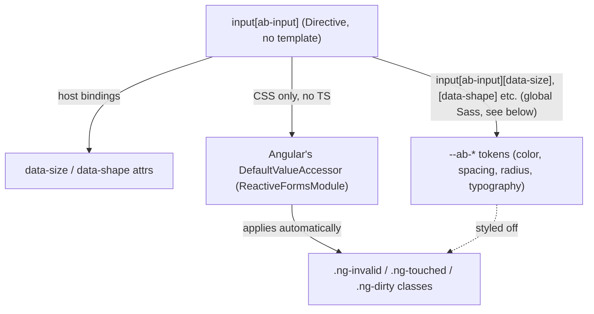

# Architecture — AbInput (first form control)

PRD: none (L2 run, no PRD — see `specs/ab-input/spec.md` for the contract)
Status: approved

## Context

`projects/abbos` ships a theming service (`AbThemeService`), shared control types
(`AbControlSize`, `AbControlShape` in `src/lib/constants/`), and two unused DI tokens
(`CONTROL_SIZE`, `CONTROL_SHAPE` in `src/lib/config/tokens.ts`) — but no components yet.
`AbButton`, `AbIconButton`, `AbInput`, `AbSwitch` are documented in the root `CLAUDE.md` as
the intended surface but do not exist in code (`PROJECT-CONTEXT.md`, "Known debt").

`AbInput` is the first one built. A CLI-generated stub already exists at
`projects/abbos/src/lib/components/form/input/`:

```ts
@Component({
  selector: 'input[ab-input]',
  imports: [],
  templateUrl: './input.html',   // <p>input works!</p>
  styleUrl: './input.css',       // empty
})
export class Input {}
```

This stub is broken as written (see Trade-offs — Directive vs Component) and the class name
(`Input`) doesn't follow the library's `Ab`-prefix convention. Both are corrected here.

User-requested scope: a bare native input, used as `<input ab-input type="text" />` — no
label, no wrapper element, no projected adornments. CLAUDE.md's fuller description of
`AbInput` (icons via `abStart`/`abEnd` projected content) describes a *different*, wrapper-based
shape that cannot exist on a plain `input[ab-input]` selector (a native `<input>` cannot have
DOM children). That is out of scope for this run — see Rejected alternatives.

## Drivers

| # | Attribute | Requirement | Why it ranks here |
|---|---|---|---|
| 1 | Consistency | Establishes the pattern (`size`/`shape` via `data-*`, token consumption, forms integration) every later control follows | First component — mistakes here get copied four times |
| 2 | Accessibility | WCAG AA + 0 axe violations (mandated by `.claude/CLAUDE.md`) | Non-negotiable project quality bar |
| 3 | Minimalism | No API surface beyond what native `<input>` + Angular forms already provide | User explicitly scoped this to "just the input, no label" |
| 4 | Compatibility | Works with `ngModel`, `ReactiveFormsModule`, and Signal Forms without extra wiring | Consumers shouldn't need to know this is a design-system control to bind it |

## Design



### Components

| Component | Responsibility | Owns data | Depends on |
|---|---|---|---|
| `AbInput` (directive) | Styles a native `<input>` per `size`/`shape`; reflects both as `data-*` host attributes | None — no internal state | `AbControlSize`, `AbControlShape` (existing types); `--ab-*` tokens |

### Key flows

**Value read/write.** Not implemented by `AbInput` at all. Any native `<input>` used with
`[(ngModel)]`, `formControlName`, or `[formControl]` already gets Angular's built-in
`DefaultValueAccessor` (from `@angular/forms`) — that accessor matches on the native element,
not on the `ab-input` attribute, so it's already active before `AbInput` does anything.
`AbInput` only adds presentation.

**Invalid-state styling.** Angular's `NgControl` machinery applies `ng-invalid`/`ng-touched`/
`ng-dirty` classes to the host element automatically whenever the input participates in a
form — again, with zero code from `AbInput`. Styling keys off `input[ab-input].ng-invalid.ng-touched`
(global Sass selector, not `:host()` — see the Directive-vs-Component trade-off below).

## Trade-offs

### Decision — `Directive`, not `Component`

**Option A: Keep `@Component` (the current stub)**
- ❌ A native `<input>` is a void element — it cannot have DOM children. A `@Component`'s
  template is rendered as the host's content, which the browser silently drops for `<input>`.
  The current `templateUrl` (`<p>input works!</p>`) never renders; the stub only "works"
  because nothing has asserted on its output yet.
- ❌ Forces a `styleUrl`/`templateUrl` pair that is pure boilerplate for an element with no
  view of its own.

**Option B: `@Directive`**
- ✅ Matches how Angular Material's `MatInput` solves the identical problem (decorate a
  native, childless form element).
- ✅ No dead template file, no confusion about "why doesn't my content render."
- 📌 Best when: the selector targets a native element that already renders itself.

**Chosen**: B, `@Directive`. **Revisit when**: a design ever needs `AbInput` to render its own
markup (e.g. a wrapper for adornments) — at that point it becomes a second, wrapper-based
component with a different selector, not a change to this directive.

**Consequence discovered during implementation**: Angular's `@Directive` decorator has no
`styles`/`styleUrl` field (confirmed against `node_modules/@angular/core`'s type
definitions) — only `@Component` supports view-encapsulated styles, because encapsulation is
a property of a component's own view, which a directive doesn't have. `AbInput`'s styles
therefore cannot live in a `styleUrl` file at all, regardless of the Directive-vs-Component
call above. They ship instead as a Sass partial co-located with the component
(`components/form/input/_input.scss`, mirroring `ng-package.json`'s `**/*.scss` asset glob,
which already anticipates nested component partials, not just `assets/styles/`), aggregated
into a new `components` mixin forwarded from `_index.scss` alongside the existing `core`/
`base`/`fonts` mixins. Consumers must `@include abbos.components;` for any shipped component
to be styled — this is a new, additive entry in the library's public Sass surface, not a
change to an existing one. Every future Directive-based control follows the same shape.

### Decision — No custom `ControlValueAccessor`

**Option A: Implement `NG_VALUE_ACCESSOR` on `AbInput` (matches CLAUDE.md's current wording)**
- ❌ Angular's own `DefaultValueAccessor` already matches any native, non-checkbox `<input>`
  used with a form directive. A second accessor on the same element either does nothing (dead
  code) or fights the built-in one for control of `writeValue`/`registerOnChange`.
- ❌ No test could prove it does anything real value-reading `DefaultValueAccessor` doesn't
  already do.

**Option B: No accessor — presentation only**
- ✅ Forms integration is free, already covered by Angular's own tests, and correct by
  construction.
- ✅ Directive stays minimal — no injected `ChangeDetectorRef`, no `writeValue`/`registerOnChange`
  boilerplate.
- ❌ CLAUDE.md's line "`AbInput` (`ab-input`, ControlValueAccessor)" becomes misleading.
  Corrected as part of this run (see `specs/ab-input/spec.md` Artifacts).

**Chosen**: B. See ADR-0001. **Revisit when**: never, unless `AbInput` stops being a plain
`input[ab-input]` directive.

### Decision — `variant` input deferred

CLAUDE.md documents `variant` as shared vocabulary across all controls, but does not enumerate
values for `AbInput`, and the design source of truth (sibling `AbbosDesignSystem` React repo)
is not available in this repo to consult. Inventing values (`outline`/`filled`/etc.) would
violate Article X (explicit unknowns). `AbInput` ships this run with a single, token-driven
visual style; `variant` is `[NEEDS CLARIFICATION]` and backlogged.

## Cross-cutting

| Concern | Approach |
|---|---|
| Auth / authz | N/A — no data access |
| Validation | N/A — delegated entirely to the consumer's `ReactiveFormsModule`/Signal Forms validators; `AbInput` only styles the resulting state |
| Errors | N/A — directive cannot fail at runtime beyond standard Angular template errors |
| Observability | N/A |
| Config & secrets | N/A |
| Accessibility | See `specs/ab-input/spec.md` AC-U — labeling is entirely the consumer's responsibility since this directive renders no label; documented prominently in the directive's TSDoc |

## Rejected alternatives

| Alternative | Why not |
|---|---|
| `ab-input` as a custom element wrapping an inner `<input>` with `abStart`/`abEnd` projected adornments (CLAUDE.md's fuller description) | Contradicts the user's explicit ask (`<input ab-input type="text" />`, "just the input without label"). Also a materially different component (wrapper + projection), not a refinement of this one. Backlogged as a distinct future component, not a variant of `AbInput`. |
| Implementing `ControlValueAccessor` on `AbInput` for CLAUDE.md-literalism | See Trade-offs above and ADR-0001. |
| Adding `axe-core`/`jest-axe` to the test toolchain now, to make every AC-U criterion command-verifiable | Real infrastructure work (new dependency, new test harness) with no current second consumer. Scoped down to unit-test attribute/class assertions + a manual contrast/keyboard verification for this run; backlogged for `aidd-qa` to pick up when a second component needs the same harness. |

## Consequences

**Accepted costs**: `size`/`shape` cannot yet be driven by the unused `CONTROL_SIZE`/
`CONTROL_SHAPE` DI tokens — those tokens imply a parent (e.g. a future form-field wrapper)
broadcasting defaults to children, which doesn't exist yet. `AbInput` takes `size`/`shape` as
plain `input()`s for now; wiring the DI tokens is a separate, backlogged decision once a
second consumer of those tokens exists.

**New constraints**: Every future form control follows this run's two conventions —
`Directive` (not `Component`) for anything decorating a native form element with no view of
its own, and no custom `ControlValueAccessor` unless the native element genuinely has none
(true for `<input>`/`<textarea>`/`<select>`; not true for anything without a native form
element, e.g. a custom toggle).

**Debt created**: `variant` unspecified (backlog). Automated a11y regression testing
unspecified (backlog). CLAUDE.md's `AbInput` bullet corrected but its `abStart`/`abEnd`
adornment description is left as aspirational roadmap text, not implemented.
